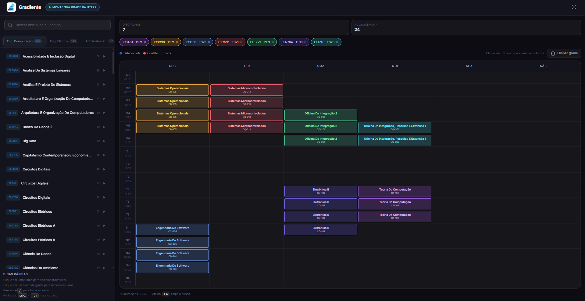

# Gradiente

Aplicação web para montar grade de horários da UTFPR, com busca de disciplinas, seleção de turmas e visualização de conflitos.

## Preview



## Funcionalidades

- Busca de disciplinas por código, nome e professor.
- Abas por curso com troca rápida.
- Seleção de uma turma por disciplina.
- Visualização de conflitos de horário na lista e na grade.
- Preview na grade ao passar o mouse sobre uma turma na sidebar.
- Navegação por teclado na busca/lista e nas abas de cursos.
- Tema claro/escuro com persistência.
- Persistência local do estado da sessão (`localStorage`):
  - curso ativo
  - texto da busca
  - turmas selecionadas
- Configuração centralizada de cursos em `data/courses.json` (frontend + scripts Python).

## Cursos disponíveis

- Engenharia de Computação
- Engenharia Elétrica
- Administração
- Design
- Educação Física
- Engenharia Mecatrônica

## Stack

- Frontend: Vite + JavaScript (ES modules)
- Coleta e parse de dados: Python (`requests` + parser HTML)

## Requisitos

- Node.js 18+ (recomendado)
- npm
- Python 3.10+
- pacote Python `requests`

## Instalação

```bash
npm install
python3 -m pip install requests
```

## Rodando em desenvolvimento

```bash
npm run dev
```

Servidor padrão: `http://localhost:5173`

## Build de produção

```bash
npm run build
npm run preview
```

## Atalhos de teclado

- `/`: foca a busca.
- `Esc` (na busca): limpa o texto.
- `↑/↓`: navega entre disciplinas/turmas na sidebar (com foco na busca).
- `→/←`: expande/colapsa disciplina e navega entre disciplina/turma.
- `Enter`: seleciona/aciona item ativo da sidebar.
- `Ctrl + ←/→` (na busca): troca de curso.
- `←/→` com foco nas tabs de curso: navega entre cursos.

## Estrutura principal

```text
.
├── src/
│   ├── main.js        # estado global, persistência e orquestração da UI
│   ├── sidebar.js     # tabs, busca, lista, navegação por teclado
│   ├── grid.js        # grade semanal, conflitos e preview por hover
│   ├── data.js        # datasets, busca e utilitários
│   └── style.css      # design system e layout responsivo
├── data/
│   ├── courses.json       # catálogo de cursos (id, label, utfprCode, sampleHtml opcional)
│   └── disciplinas_*.json # dados gerados/consumidos pelo frontend
├── scripts/
│   └── parse_disciplinas.py # parser de HTML local -> JSON
├── fetch_disciplinas.py   # coleta na UTFPR e gera JSON por curso
├── media/                 # assets de mídia (logo/screenshot)
├── public/                # assets estáticos servidos pelo Vite
├── index.html             # shell da aplicação
└── vite.config.js
```

## Dados das disciplinas

O app consome arquivos `data/disciplinas_*.json`.

### Como adicionar um curso sem mexer no codigo

Edite apenas `data/courses.json` e adicione um item com:

- `id`: identificador usado no nome do JSON (`disciplinas_<id>.json`)
- `label`: nome exibido na aba do frontend
- `utfprCode`: codigo usado na URL da UTFPR
- `sampleHtml` (opcional): nome do HTML local para `scripts/parse_disciplinas.py`

Exemplo:

```json
{
  "id": "mecanica",
  "label": "Eng. Mecanica",
  "utfprCode": "SEU_CODIGO_AQUI",
  "sampleHtml": "disciplinas_mecanica.html"
}
```

### Opção 1: Coletar dados atuais da UTFPR

1. Crie um arquivo `.env` na raiz com:

```dotenv
UTFPRSSO=seu_token_aqui
```

2. Rode:

```bash
python3 fetch_disciplinas.py
```

Esse script le `data/courses.json` e gera/atualiza automaticamente:

- `data/disciplinas_computacao.json`
- `data/disciplinas_eletrica.json`
- `data/disciplinas_administracao.json`
- `data/disciplinas_design.json`
- `data/disciplinas_edfisica.json`
- `data/disciplinas_mecatronica.json`

### Opção 2: Parse de HTML local (amostras)

Se você tiver HTMLs salvos localmente:

```bash
python3 scripts/parse_disciplinas.py
```

Esse script le `data/courses.json` e tenta converter:

- `sampleHtml` de cada curso (quando definido), ou
- `disciplinas_<id>.html` (fallback)

Saida: `data/disciplinas_<id>.json` para cada HTML encontrado.

## Scripts disponíveis

- `npm run dev`: inicia o servidor de desenvolvimento
- `npm run build`: gera build de produção em `dist/`
- `npm run preview`: sobe servidor para validar o build

## Observações

- O favicon usa `public/media/gradiente_logo.jpg`.
- O repositório ignora `data/disciplinas_*.json` e `*.html`; se necessário, gere os arquivos localmente.
- Não há suíte de testes automatizados no momento.
